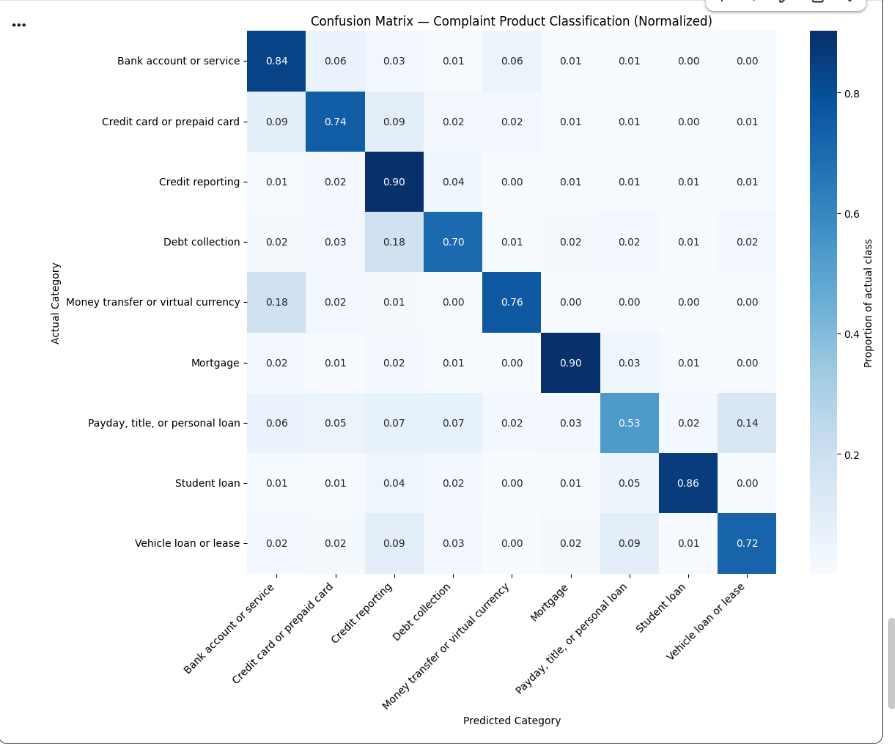

# Consumer Complaint Product Classification

A text classification model that predicts the financial product category (e.g. Credit reporting, Mortgage, Debt collection) from raw consumer complaint narratives, trained on the CFPB Consumer Complaint Database.

## 🚀 Live App

[consumer-complaint-classification.streamlit.app](https://consumer-complaint-classification.streamlit.app/)

## Problem

The CFPB (Consumer Financial Protection Bureau) publishes millions of consumer complaints against financial companies, each including a free-text narrative describing the issue. This project builds a model that automatically routes a complaint to the correct product category based on that narrative text alone — a real-world use case for automating complaint triage instead of manual tagging.

## Dataset

- **Source:** CFPB Consumer Complaint Database
- **Size:** ~8GB CSV, 3.8M+ rows after filtering to complaints with a non-empty narrative
- **Target:** `Product` category
- **Features:** `Consumer complaint narrative` (free text)

### Data Cleaning

The raw dataset had 21 `Product` categories, but many were duplicates created by CFPB taxonomy changes over time (e.g. `Credit reporting`, `Credit reporting, credit repair services, or other personal consumer reports`, and `Credit reporting or other personal consumer reports` all describe the same category, just relabeled at different points). These were consolidated into 9 clean categories:

- Credit reporting
- Debt collection
- Bank account or service
- Credit card or prepaid card
- Mortgage
- Money transfer or virtual currency
- Student loan
- Vehicle loan or lease
- Payday, title, or personal loan

A category with only 292 rows (`Other financial service`) was dropped entirely — too few examples for any model to learn a reliable pattern from.

## Engineering Challenge: Training on 3.8M Rows with 12GB RAM

The full dataset doesn't fit comfortably in memory on a free-tier Colab instance (~12GB RAM available). Several techniques were used to make training feasible without subsampling the data away:

- **Lazy CSV loading** (`polars.scan_csv`) — only the columns actually needed were selected and materialized, instead of loading all columns of the raw file.
- **HashingVectorizer instead of TfidfVectorizer** — TF-IDF requires building and storing a full vocabulary in memory before transforming, which becomes very large at this row count. `HashingVectorizer` maps tokens directly to a fixed number of hash buckets with no stored vocabulary, keeping memory constant regardless of dataset size.
- **Out-of-core batch training** — the vectorized matrix for the full training set was never materialized at once. Instead, `SGDClassifier.partial_fit()` was used to train incrementally in batches of 30,000 rows, discarding each batch from memory after use.
- **Manual class weighting** — `SGDClassifier` does not support the `'balanced'` class_weight string with `partial_fit`. Weights were computed once upfront with `compute_class_weight()` and passed in as an explicit dictionary, so minority classes (e.g. Payday loans, Vehicle loans) were not overwhelmed by the majority Credit reporting class during training.

## Model

- **Vectorizer:** `HashingVectorizer` (2^19 features, unigrams + bigrams, English stop words removed)
- **Classifier:** `SGDClassifier` (hinge loss — equivalent to a linear SVM), trained via `partial_fit` over 3 epochs with shuffled batches each epoch
- **Class balancing:** manually computed balanced class weights passed as a dictionary

## Results

**Accuracy: 85.3%** | **Weighted F1: 0.86** | **Macro F1: 0.72**

| Category | Precision | Recall | F1-score | Support |
|---|---|---|---|---|
| Credit reporting | 0.95 | 0.90 | 0.92 | 502,053 |
| Mortgage | 0.80 | 0.90 | 0.85 | 29,023 |
| Money transfer or virtual currency | 0.80 | 0.76 | 0.78 | 24,158 |
| Bank account or service | 0.70 | 0.84 | 0.76 | 39,694 |
| Debt collection | 0.74 | 0.70 | 0.72 | 88,199 |
| Credit card or prepaid card | 0.69 | 0.74 | 0.72 | 48,781 |
| Student loan | 0.63 | 0.86 | 0.73 | 12,402 |
| Vehicle loan or lease | 0.44 | 0.72 | 0.55 | 10,439 |
| Payday, title, or personal loan | 0.37 | 0.53 | 0.44 | 9,190 |

A naive baseline that always predicted the majority class (Credit reporting) would score ~55% accuracy — the model is clearly learning real distinguishing signal from the text, not just riding class imbalance.

### Confusion Matrix



The normalized confusion matrix shows that most of the model's errors are concentrated in a few specific, explainable pairs:

- **14%** of actual *Payday, title, or personal loan* complaints were predicted as *Vehicle loan or lease* — consistent with title loans commonly being secured against a vehicle, so the complaint language genuinely overlaps between the two categories.
- **18%** of actual *Money transfer or virtual currency* complaints were predicted as *Bank account or service* — transfers are frequently discussed in the context of a checking/savings account.
- **18%** of actual *Debt collection* complaints were predicted as *Credit reporting* — disputed debts are often described in terms of what shows up on a credit report.

This suggests the remaining errors are largely driven by genuine semantic overlap between categories in the underlying complaint narratives, rather than an undertrained model.

## App Features

Beyond the model itself, the deployed Streamlit app adds a few things worth calling out:

- **Bilingual input (English + Urdu):** since the model was trained only on English complaints, Urdu input is automatically translated to English (via `deep-translator`) before classification. The translated text is shown transparently so it's clear exactly what the model actually saw — this is a translate-then-classify pipeline, not native Urdu understanding.
- **Voice input:** complaints can be typed or spoken (in either language) using Streamlit's built-in audio recorder, transcribed via `SpeechRecognition`. Speech-to-text errors are a real, observed failure mode — see the example below.
- **Per-prediction confidence:** since the model uses hinge loss (no calibrated probabilities), confidence is computed by applying softmax to the raw decision scores across all 9 categories, and displayed both as ranked bars and as a radar chart.
- **Dark, card-based UI** styled after a reference SaaS product design, rather than default Streamlit theming.

### A real multilingual failure case

Testing the Urdu voice pipeline surfaced a genuine, traceable error: a spoken complaint about **credit card fraud** was misclassified as **Debt collection** (41.4% confidence) instead of **Credit card or prepaid card**. Tracing the pipeline showed the speech recognizer mistranscribed "جعلی چارج" (*fraudulent charge*) as an unrelated phrase, stripping the fraud signal before translation or classification ever occurred. The classifier correctly handled the (corrupted) text it received — the error originated upstream, in speech recognition, not in the model. This is a useful, honest illustration that in a speech-based pipeline, errors can compound before the model ever sees clean input.

## What Didn't Work (and Why That's Useful to Know)

Two follow-up experiments were run to try to close the gap on the weakest categories (Payday loan, Vehicle loan):

1. **Additional training epochs** (1 → 3 passes over the data)
2. **Adding bigrams** to the vectorizer (previously unigrams only)

Neither meaningfully changed the results (accuracy moved from 85.26% to 85.31%). This is a useful negative result: it suggests the linear model had already converged after one pass on this much data, and that the remaining confusion is a limitation of bag-of-words representations rather than a training or tuning issue — the model can't distinguish "vehicle loan default" from "personal loan default" language it hasn't been given the semantic context to differentiate. Closing this gap further would likely require an embedding-based or transformer-based representation capable of capturing meaning rather than word frequency alone.

## Usage

```python
import joblib

clf = joblib.load('complaint_product_classifier.pkl')
vectorizer = joblib.load('hashing_vectorizer.pkl')

def predict_category(text, clf, vectorizer):
    X = vectorizer.transform([text])
    return clf.predict(X)[0]

predict_category(
    "I have been trying to get my credit report corrected for months and no one responds.",
    clf, vectorizer
)
```

## Repository

[github.com/MaryumAkram16/Consumer-Complaint-Product-Classification](https://github.com/MaryumAkram16/Consumer-Complaint-Product-Classification)

## Tech Stack

- `polars` — memory-efficient CSV loading and data cleaning at scale
- `scikit-learn` — HashingVectorizer, SGDClassifier, evaluation metrics
- `matplotlib` / `seaborn` — visualization (training/evaluation)
- `joblib` — model persistence
- `streamlit` — deployed app interface
- `SpeechRecognition` — voice-to-text input
- `deep-translator` — Urdu → English translation

## Possible Next Steps

- Merge the most-confused categories (e.g. Payday/title/personal loan and Vehicle loan) into a broader bucket to test whether accuracy improves when the category boundaries better match what's separable in the text.
- Compare against `ComplementNB`, which is designed specifically for imbalanced text classification.
- Fine-tune a transformer model (e.g. DistilBERT) on a stratified subsample to test whether a semantic, context-aware representation closes the gap that bag-of-words features could not.
